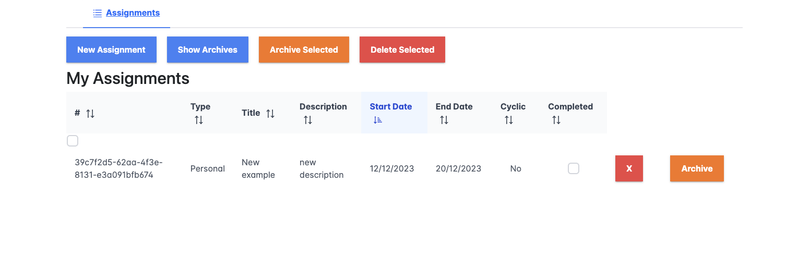

# Assignments App
The Assignments App is a web application designed to help users manage and organize their tasks effectively. The application consists of two main components: the Assignments.API backend, built with ASP.NET Core and C#, and the Assignments.Client frontend, developed using Angular.




## Assignments.API (ASP.NET Core - C#)

### Project Overview
The Assignments.API is a .NET Core project built with C# that serves as the backend API for managing assignments. It provides various endpoints to perform CRUD operations on assignments.

### Getting Started

1. **Configure Database Connection:**
   Open the `appsettings.json` file and configure the `AssignmentDbConnectionString` with the appropriate user ID and password for your SQL Server.

2. **Apply Database Migrations:**
   Make sure you have an Assignments database.
   Run the following command in the terminal to apply the database migrations:
   ```bash
   dotnet ef database update
   ```
   
### Run the API:
Execute the following command to run the API project:
```bash
dotnet run
```

# API Endpoints
* Retrieves all assignments sorted by start date in descending order.
`GET /api/assignment`
* Retrieves a specific assignment by ID.
`GET /api/assignment/{id}`
* Retrieves assignments filtered by assignment type.
`GET /api/assignment/type/{assignmentType}`
* Adds a new assignment.
`POST /api/assignment`
* Updates the completion status of a specific assignment.
`PUT /api/assignment/{id}/completed`
* Updates the archive status of a specific assignment.
`PUT /api/assignment/{id}/archive`
* Deletes a specific assignment.
`DELETE /api/assignment/{id}`

# Assignments.Client (Angular)
## Project Overview
The Assignments.Client is an Angular project that serves as the frontend for interacting with the Assignments.API. It provides user interfaces for managing assignments.

## Getting Started
1. ### Update API URL:
Open `assignment.service.ts` and update the `baseApiUrl` to match the URL of your running Assignments.API.

2. ### Run the Angular App:
Execute the following command in the terminal to start the Angular app:
```bash
npm start
```

## Components
`assignments.component`
* Displays a list of assignments and provides functionalities like sorting and archiving.
`new-assignment.component`
* Allows users to add new assignments.
## Models
`assignment.model`
* Defines the structure of an assignment.
## Services
`assignment.service`
* Handles communication with the Assignments.API, including methods for retrieving, adding, updating, and deleting assignments.


